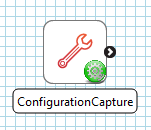
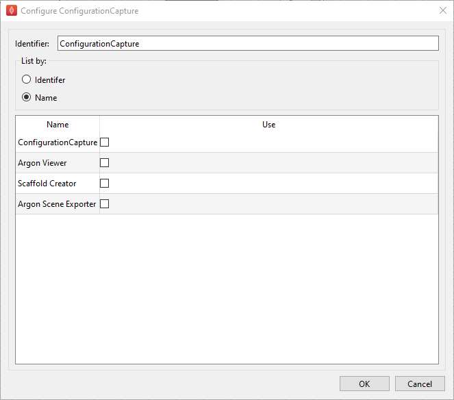

Configuration Capture
=====================

Overview
--------

The **Configuration Capture** is a MAP Client plugin for capturing configurations from the current workflow.
The plugin provides a list of configuration files.

.. _fig-mcp-configurationcapture-configured-step:

   An configured *Configuration Capture* step icon.

Specification
-------------

Information on this plugins' specification is available :ref:`here <mcp-configurationcapture-specification>`.

Configuration
-------------

The configuration capture step is a step to find and pass on configuration files from the current workflow.

.. _fig-mcp-configurationcapture-configure-dialog:

   Configuration capture step configuration dialog, showing a list of available configurations listed by step name.

The list of available configurations is updated whenever the step configuration dialog is shown.
Available configurations can be listed by name or identifier, when listed by name multiple configurations will be captured if there are multiple steps present with that name.
Configurations are only captured if the corresponding check box is checked in the table.

Instructions
------------

This is a non-interactive step.
See `Configuration`_.
